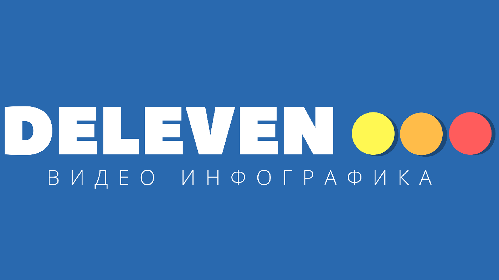

# deleven
GitHub Pages
<!DOCTYPE html>
<html>
<head>
  <!-- Site made with Mobirise Website Builder v3.12.1, https://mobirise.com -->
  <meta charset="UTF-8">
  <meta http-equiv="X-UA-Compatible" content="IE=edge">
  <meta name="generator" content="Mobirise v3.12.1, mobirise.com">
  <meta name="viewport" content="width=device-width, initial-scale=1">
  <link rel="shortcut icon" href="assets/images/deleven-7-227x128.png" type="image/x-icon">
  <meta name="description" content="Web Page Generator Description">
  <title>Web Page Generator Title</title>
  <link rel="stylesheet" href="https://fonts.googleapis.com/css?family=Roboto:700,400&amp;subset=cyrillic,latin,greek,vietnamese">
  <link rel="stylesheet" href="assets/bootstrap/css/bootstrap.min.css">
  <link rel="stylesheet" href="assets/socicon/css/socicon.min.css">
  <link rel="stylesheet" href="assets/mobirise/css/style.css">
  <link rel="stylesheet" href="assets/mobirise/css/mbr-additional.css" type="text/css">
  
  
  
</head>
<body>
<section class="mbr-navbar mbr-navbar--freeze mbr-navbar--absolute mbr-navbar--sticky mbr-navbar--auto-collapse" id="ext_menu-a">
    

        

            

                

                    
                        
                        
                    
                

                

                

                    <nav class="mbr-navbar__menu-box mbr-navbar__menu-box--inline-right">
                        

                            <ul class="mbr-navbar__items mbr-navbar__items--right float-left mbr-buttons mbr-buttons--freeze mbr-buttons--right btn-decorator mbr-buttons--active mbr-buttons--only-links"><li class="mbr-navbar__item"></li> <li class="mbr-navbar__item"></li> <li class="mbr-navbar__item"><a class="mbr-buttons__link btn text-white" href="index.html">Главная страница</a></li><li class="mbr-navbar__item"><a class="mbr-buttons__link btn text-white" href="page2.html">О нас</a></li><li class="mbr-navbar__item"><a class="mbr-buttons__link btn text-white" href="page1.html">Цены</a></li></ul>                            
                            
                        

                    </nav>
                

            

        

    

</section>

<section class="engine"><a rel="external" href="https://mobirise.com">https://mobirise.com/</a></section><section class="mbr-section mbr-section--relative mbr-after-navbar" id="msg-box4-k" style="background-color: rgb(41, 105, 176);">
    
    

        

            

                

                    <figure class="mbr-figure mbr-figure--adapted mbr-figure--caption-inside-bottom mbr-figure--full-width"></figure>
                

                

                    

                        

                            <h3 class="mbr-header__text">&nbsp; &nbsp; &nbsp; &nbsp; &nbsp;Deleven</h3>
                            
                        

                    

                    

                        
Создаём видео инфографику, обучающие видео, анимационые видео ролики. В видео инфографики можно легко и понятно донести зрителю смысл видео.

                    

                    

                        
<a class="mbr-buttons__btn btn btn-lg btn-default" href="page1.html">Связать о покупке</a>

                    

                

                
            

        

    

</section>

<section class="mbr-section mbr-section--relative mbr-section--fixed-size" id="content5-m" style="background-color: rgb(41, 105, 176);">
    
    

        

            

                <h3 class="mbr-header__text">О нас</h3>
                
            

        

    

    

        

            
Занимаемся созданием видео роликов, логотив, интро, видео анимацией, презинтаций. Используем программы для выполнея проектов: Adobe After Effects CS6, Adobe Premiere Pro CC 2017, Illustrator CC, Photoshop CS6. Связаться с нами можно по электроной почте dan.freygang@gmail.com.

        

    

    
</section>

<section class="mbr-section mbr-section--relative" id="msg-box4-n" style="background-color: rgb(41, 105, 176);">
    
    

        

            

                

                    <figure class="mbr-figure mbr-figure--adapted mbr-figure--caption-inside-bottom mbr-figure--full-width"></figure>
                

                

                    

                        

                            <h3 class="mbr-header__text">Наш ютуб канал</h3>
                            
                        

                    

                    

                        
На канале This is Интересно вы сможете познакомится с примерами работ Deleven.

                    

                    

                        
<a class="mbr-buttons__btn btn btn-lg btn-default" href="https://www.youtube.com/channel/UC_OpaY_ZBbxOXO6wmkntjiw">Перейти на канал</a>

                    

                

                
            

        

    

</section>

<section class="mbr-section mbr-section--relative mbr-section--fixed-size" id="form1-o" style="background-color: rgb(239, 239, 239);">
    
    

        

            

                

                    

                        

                            <h2 class="mbr-header__text">Связать о покупке</h2>
                        

                        

                            
Thanks for filling out form!

                        

                        <form action="https://mobirise.com/" method="post" data-form-title="Связать о покупке">
                            <input type="hidden" value="YNwmFjKG0yo8p8+ANpBfJzBFzEGKG4A40nNXzbW4Z4XCWOHJnx/dIKeGUucz0pBh66SW90SlscJRLOCT5ktQ1XnRXQHzcpzLgAyKq2blneYr5YH29H6jh3bu6G0iqSjB" data-form-email="true">
                            

                                <input type="text" class="form-control" name="name" required="" placeholder="Имя*" data-form-field="Name">
                            

                            

                                <input type="email" class="form-control" name="email" required="" placeholder="Электроная почта*" data-form-field="Email">
                            

                            
                            

                                <textarea class="form-control" name="message" rows="7" placeholder="Сообщение" data-form-field="Message"></textarea>
                            

                            
<button type="submit" class="mbr-buttons__btn btn btn-lg btn-danger">Отправить</button>

                        </form>
                    

                

            

        

    

</section>

<section class="mbr-section mbr-section--relative mbr-section--fixed-size" id="social-buttons2-p" style="background-color: rgb(240, 240, 240);">
    

    

        

            

                <h3 class="mbr-header__text">Мы в соц сетях</h3>
            

            
  <a class="mbr-social-icons__icon socicon-bg-googleplus" title="Google+" target="_blank" href="https://plus.google.com/u/0/113005305331851582959"><i class="socicon socicon-googleplus"></i></a> <a class="mbr-social-icons__icon socicon-bg-youtube" title="YouTube" target="_blank" href="https://www.youtube.com/channel/UC_OpaY_ZBbxOXO6wmkntjiw/about"><i class="socicon socicon-youtube"></i></a> <a class="mbr-social-icons__icon socicon-bg-instagram" title="Instagram" target="_blank" href="https://www.instagram.com/_this_interestin/"><i class="socicon socicon-instagram"></i></a>      

        

    

</section>

  
  
  
  <!--[if lte IE 9]>
    
  <![endif]-->
  
  
  
  
</body>
</html>
